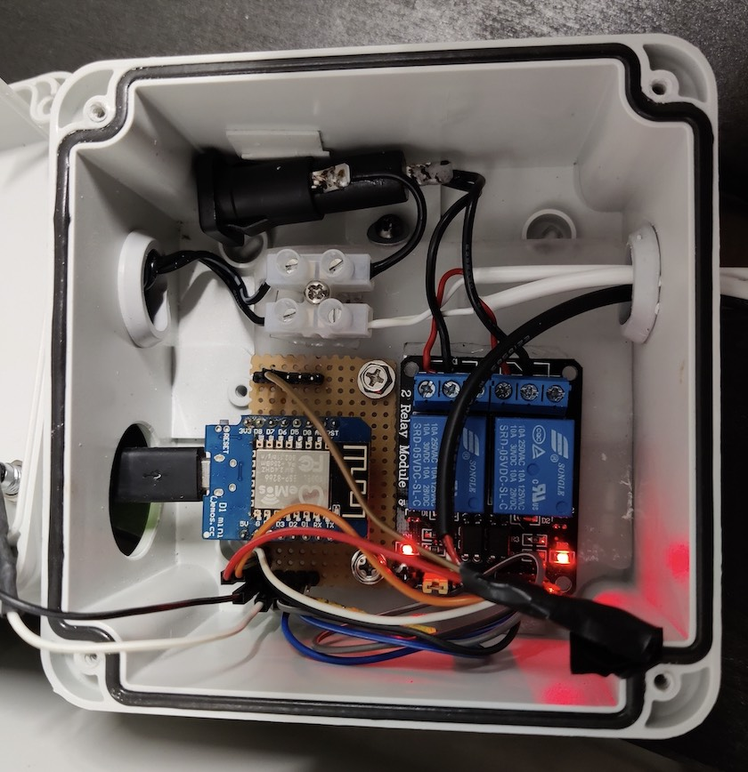

# kepu-control
Control lights and water for a kitchen garden (keittiöpuutarha, kepu)

Hardware used to build a prototype

* WeMos D1 Mini v2 NodeMCU ESP8266
* Two channel relay module
* DS18B20 1-Wire Temperature Sensor



## Firmware project
Create WiFiConfig.h with your wifi configuration
```
#define WIFI_SSID <your wifi ssid>
#define WIFI_PASSWORD <your wifi password>
```
Compile and upload to your ESP8266.

## Client project
Change default host and port
```
DEFAULT_HOST = <your ESP8266 host ip>
DEFAULT_PORT = <your ESP8266 host port>
```

## Scheduling solution
Build and deploy Dockerfile
```
$ docker build -t markotuononen/kepu-cron:latest .
$ docker login
$ docker push markotuononen/kepu-cron:latest
```
Deploy as a Docker stack (or use some other orchetrator)
```
$ docker stack deploy -c kepu-stack.yaml tregren
```
